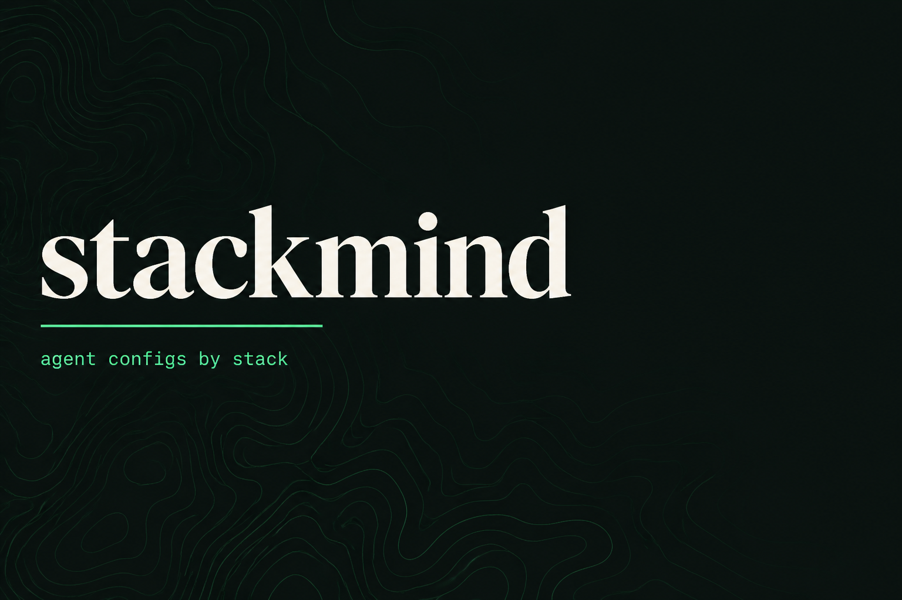

<p align="center">
  
</p>

<p align="center">
  <strong>stackmind</strong><br/>
  <em>Give your coding agent a memory of the stack, not another blank chat.</em>
</p>

<p align="center">
  <a href="https://github.com/mohabdelkarim/stackmind/blob/main/LICENSE"></a>
  <a href="https://github.com/mohabdelkarim/stackmind/releases"></a>
  <a href="#two-commands"></a>
  <a href="#stacks"></a>
</p>

---

### The pitch

You open Cursor or Claude Code on a new repo.  
The agent does not know your folder layout, your conventions, or which MCP servers you trust.

**stackmind** drops in a ready kit for your stack: `AGENTS.md`, Claude manual, Cursor rules, pinned MCP config.  
One command. Free. MIT. No upsell.

```text
  you ──init──▶ kit files ──▶ agent that already knows the house rules
```

---

<a id="two-commands"></a>
### Two commands

```bash
# pick a stack
npx github:mohabdelkarim/stackmind init nextjs
# or: python | nestjs | vue_nuxt

# preview changes, then upgrade later
npx github:mohabdelkarim/stackmind init nextjs --diff --dry-run
npx github:mohabdelkarim/stackmind upgrade nextjs .

# sanity check
npx github:mohabdelkarim/stackmind doctor .
```

Restart Cursor / Claude Code. Ask: *“What conventions does this project use?”*  
It should answer from the kit, not invent a new architecture.

<details>
<summary><strong>Clone + local CLI</strong></summary>

```bash
git clone https://github.com/mohabdelkarim/stackmind.git
cd stackmind
npm ci
node bin/stackmind.js list
node bin/stackmind.js init nextjs ~/your_project
npm run demo_proof
```

</details>

---

<a id="stacks"></a>
### Stacks

| Kit | Install | Vibe |
|-----|---------|------|
| **Next.js 15** | `init nextjs` | App Router, RSC default, Zod env, Prisma when needed |
| **Python FastAPI** | `init python` | Thin routers, `app/services`, async, Pydantic v2 |
| **NestJS** | `init nestjs` | Feature modules, DI, thin controllers |
| **Vue / Nuxt 3** | `init vue_nuxt` | `pages/` + `server/api`, Composition API |

What lands in your repo:

| File | Job |
|------|-----|
| `AGENTS.md` | Canonical rules for every agent |
| `.claude/CLAUDE.md` | Short Claude Code manual |
| `.cursor/rules/*.mdc` | Glob scoped Cursor overlays (api, db, security, tests where present) |
| `.cursor/mcp.json` | Merged, version pinned MCP servers |
| `stackmind_recipes/` | Ready snippets (health route, env, migrations) |

---

### Proof, not vibes

Live sample apps ship in the repo and get smoke tested:

| Live app | Proof |
|----------|--------|
| [`examples/nextjs_live`](examples/nextjs_live) | `npm run build` |
| [`examples/python_live`](examples/python_live) | `pytest` |
| [`examples/nestjs_live`](examples/nestjs_live) | structure smoke |
| [`examples/vue_nuxt_live`](examples/vue_nuxt_live) | structure smoke |

```bash
npm run validate
npm run eval
npm run cli_smoke
npm run demo_proof
npm run live_smoke
```

Visual walkthrough: [`docs/demo.html`](docs/demo.html) · full notes: [`docs/DEMO.md`](docs/DEMO.md) · log: [`docs/PROOF_LOG.md`](docs/PROOF_LOG.md)

---

### Fresh MCP pins (weekdays)

A boring, deterministic GitHub Action (Mon–Fri, 07:00 UTC) checks npm for newer MCP package versions, rewrites pins in `configs/*/mcp/`, validates JSON, and commits as **MOHAbdelkarim**. No weekend runs. No LLM rewriting your configs.

```bash
npm run check
npm run update
npm run validate
```

---

### CLI map

```bash
stackmind list
stackmind doctor [dir]
stackmind init <stack> [dir] [--force] [--dry-run] [--diff] [--no-mcp] [--mcp-only]
stackmind upgrade <stack> [dir] [--force] [--dry-run] [--diff]
```

---

### Not this

- Not a paid Gumroad pack  
- Not a full app generator  
- Not a replacement for your product brief  
- Legacy `.cursorrules` is not installed (use `AGENTS.md` + `.mdc`)

---

### Contribute

New stacks stay **free and public**. See [`CONTRIBUTING.md`](CONTRIBUTING.md) and [`docs/ADDING_A_STACK.md`](docs/ADDING_A_STACK.md).

<p align="center">
  <sub>MIT © MOHAbdelkarim · agent configs by stack</sub>
</p>
